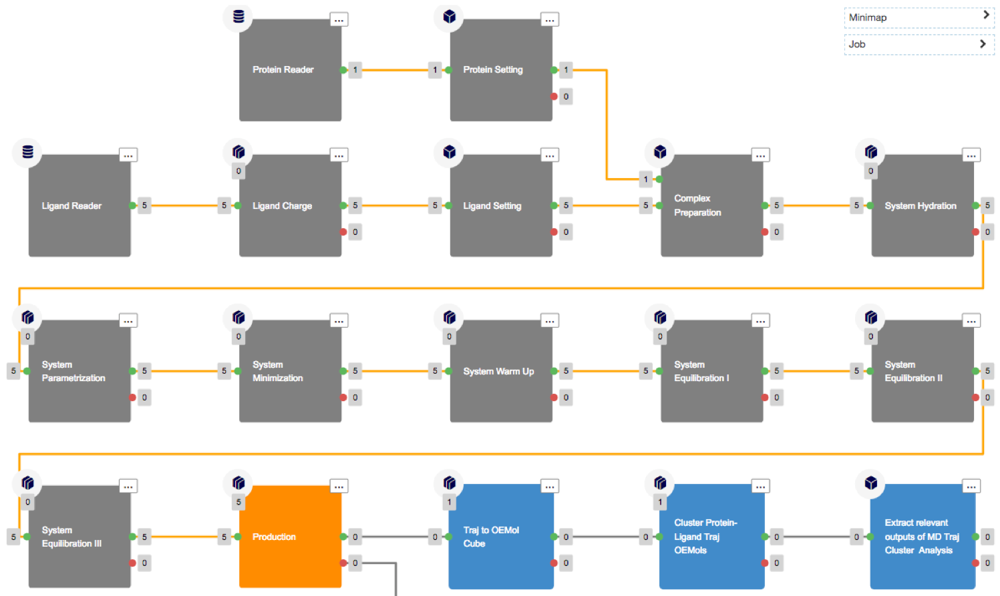
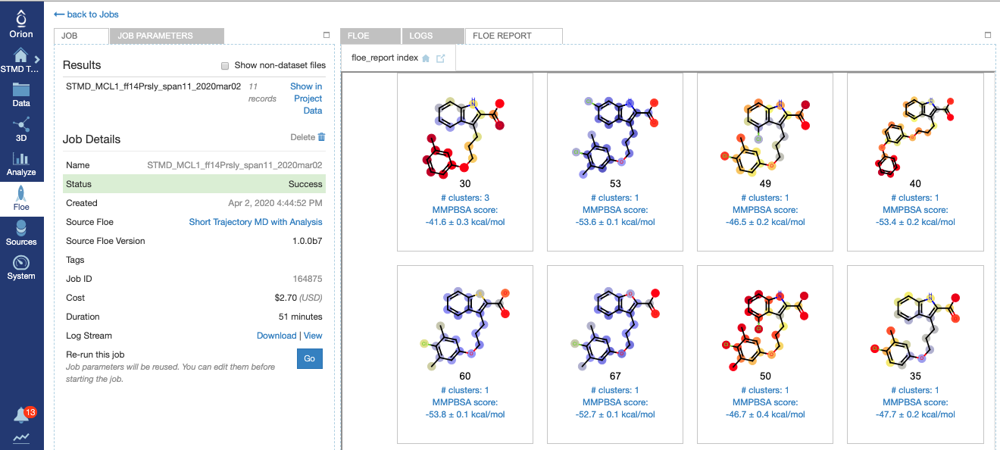
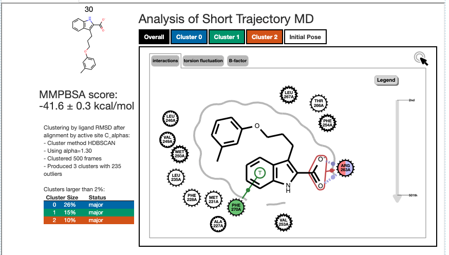
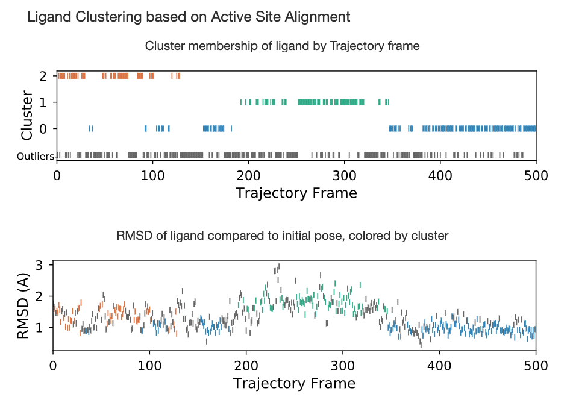
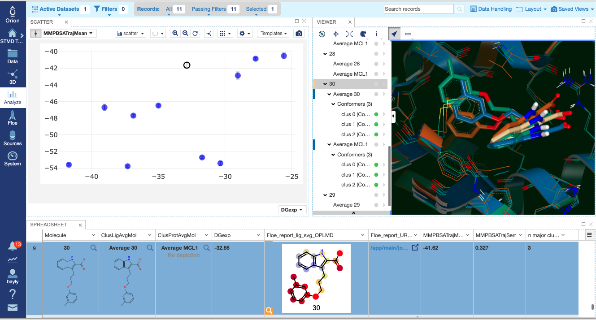

.. |A|         replace:: Å

#############
Tutorials
#############

These are tutorials for how to use specific floes.

Short Trajectory MD with Analysis
=================================

The Floe *Short Trajectory MD with Analysis* (STMD) is for pose validation.
You should start with a ligand already well posed in the active site,
which serves as an hypothesis for
ligand binding, with protein-ligand interactions in place.
This pose will be evaluated by this floe to be validated (or not) as a good pose.
We are not primarily asking the question "what is the pose for this ligand?"
but rather "is this a good pose for this ligand?", seeking an answer by running a
short MD trajectory and assessing the effect on the ligand pose especially by
comparison to the starting (input) pose.

Ligand Input
------------

Just to be able to run, this floe requires ligands to have
reasonable 3D coordinates, all atoms, and correct chemistry
(in particular bond orders and formal charges).
If the ligands already have good atomic partial charges
(we recommend RESP or AM1-BCC_ELF10 charges),
we recommend using these for STMD as opposed to re-charging
them in the STMD floe.
Given that this floe only runs a very short timescale (default 2 ns),
it is preferable that the input pose be well refined.
Although bad clashes
(or poor positioning for interactions which you know need to be there)
can be (and often are) cleaned up by even this short trajectory,
it starts off the "evaluation" purpose of the floe on the wrong foot
by giving a poor comparator.
Poor initial poses might even be considered outside the scope of this floe
given how short is the default timescale.
This is why we **strongly recommend** that docked poses be
subsequently minimized in the active site **before input to STMD**.
This will resolve high gradients
(usually clashes) with the protein and to allow protein-ligand
interactions to optimize in the context of a good force field.
It is possible that even with this pre-MD refinement,
the docked-pose starting points could be re-evaluated and
triaged prior to the extra effort and expense of STMD.

Protein Input
-------------
All the MD floes require correctly prepared protein up to "MD ready" standards.
This begins with the normal prerequisites for physics-based modeling:
protein chains must be capped,
all atoms in protein residues (including hydrogens) must be present, and missing
protein loops resolved or capped.
Of course, protein side chain formal charges and protonation
at this point determine their tautomeric state.
Additionally, cofactors and structured internal waters are also important to include,
not only those in the immediate vicinity of the ligand and active site
but also distally because they can have an important effect on the
protein structure and dynamics over the course of the MD.
We **strongly recommend** using *Spruce* for protein preparation.

.. warning::

   Unfortunately, proteins with covalently bound ligands or cofactors are currently not tractable

How to use this floe
--------------------
The structure of the STMD floe is shown in figure
`Structure of the STMD floe`.
Given the inputs of the protein and posed ligands,
the complex is formed with each ligand/conformer separately,
and the complex is solvated and parametrized according to
the selected force fields. 
We refer to this ready-to-run molecular assembly as a "flask"
by analogy to experiment: all the components are combined into
the flask, upon which we run our experiment.
A minimization stage is performed on the flask followed by
a warm up (NVT ensemble) and three equilibration stages (NPT ensemble).
In the minimization, warm up, and equilibration stages,
positional harmonic restraints are applied on the ligand and protein.
At the end of the equilibration stages a short (default 2ns) production run
is performed on the unrestrained flask.
The production run is then analyzed in terms of interactions between
the ligand and the active site and in terms of ligand RMSD,
after fitting the trajectory based on active site C_alphas.

.. figure_STMD_floe:

   **Structure of the STMD floe**

After selecting the *Short Trajectory MD with Analysis* floe in the Orion UI,
you will be presented with a job form with parameters to select.
Aside from the essential user-defined parameters relating to jobname,
input (protein and ligand datasets as described above), and
output (output and failure dataset names),
all other parameters have defaults preset to values that
we feel are suitable for the non-expert MD user
(or expert user for that matter) so launching the floe at this point is reasonable.
Of the other top-level parameters a few will be discussed here:

    * Protein_title (no default): Here is where you can put a handy short name for the protein to use in molecule titles (e.g. "Bace" instead of "beta-secretase").

    * Charge_ligands (default *True*): If your input ligands already have good atomic partial charges (e.g. `RESP` or `AM1-BCC_ELF10`), set this to *False* to have the floe use the existing ligand charges.

    * Ligand_forcefield (default *OpenFF1.0.0*): This forcefield choice has a strong impact on the results. We recommend the most recent version of the OpenFF force field from the *Open Force Field Initiative*.

    * Md_engine (default *OpenMM*): Gromacs is the other alternative but we recommend OpenMM because HMR works with it but not with Gromacs.

    * Hmr: Hydrogen Mass Repartitioning (HMR) gives a two-fold speedup and reduces cost. We recommend leaving it on.

We make the other top-level parameters available for expert users.

Accessing and Understanding the Results
---------------------------------------

The results from the STMD floe are accessed via two main avenues:
through the job output in the `Jobs` tab in Orion's `Floe` page, and
through orion's `Analyze` page.

In the `Jobs` tab in Orion's `Floe` page,
having selected the job name for your STMD job, you should land on
the job results page.
The left panel contains the usual orion job information from the run,
and the right panel has two tabs at the top if the run was not successful
or three tabs at the top if it was... we will focus on success here!
Selecting the third tab called *FLOE REPORT* should give you a
page looking similar to Figure `STMD Job results page for the MCL1 Dataset`.

.. figure_STMD_jobResults:

   **STMD Job results page for the MCL1 Dataset**

The floe report shows a tile for each MD simulation, here there was
only one conformer for each ligand in the input file.
This run was on 11 ligands in a MCL1 dataset; in the figure 8 of the
11 are shown (to see the other 3 would require scrolling down).
The atom colors correspond to calculated B-factors, similar to Xray
B-factors, depicting the mobility of those atoms in the active site
over the course of the MD trajectory.
This gives an immediate read-out on how much various fragments of
the ligand were moving around in the active site. As a general principle
greater movement suggests that that fragment is not as tightly bound
in the active site, but inferences are only qualitative. Certainly
fragments hanging out in water of even a tightly bound inhibitor will be expected
to be more mobile than the buried parts.
Other information on each tile is:

    * The ligand name; in the MCL1 case in the figure these are simply integers.

    * The number of clusters formed by clustering the ligand positions in the MD trajectory.

    * The ensemble average MMPBSA score for ligand binding over the whole MD trajectory.

Clicking on a tile drills down into the detailed analysis of that simulation.
As an example, clicking on the top left tile, for ligand 30 with 3 clusters,
results in Figure `Detailed results for ligand 30`:

.. figure_STMD_lig30interactiveSVG:

   **Detailed results for ligand 30**

In the graphic we see a 2D representation of the ligand binding
interactions for the whole trajectory, with the default display
of the `Overall` tab at the top of the graphic. It is an interactive
graphic: selecting the `Cluster 0` tab in blue, the `Cluster 1` tab
in green, or the `Cluster 2` tab in orange, will change the binding
interaction representation to that corresponding to the selected cluster.
Hovering over one of the interaction in the diagram lights up a
strip chart on the right-hand side grey arrow showing the occupancy
of that interaction over the course of the trajectory.
Within the heavy frame of the graphic, we see that the interactive
graph is on `interactions`; selecting `torsions` changes the depiction
to show a heavy black dot in each rotatable bond. Hovering over one
of these shows a radial bar graph of the occupancy of the torsion on
the right-hand side. Selecting `B-factor` yields a depiction of the
calculated B-factors for the selected cluster as in the parent tile,
but additionally shows the calculated B-factor for each active site
amino acid close to the ligand. To the right of the graphic is
information about the clustering of the ligand trajectory.

Scrolling down exposes two strip charts detailing two relevant
analyses of the trajectory, as shown for ligand 30
in Figure `Strip Chart results for ligand 30`:

.. figure_STMD_lig30stripCharts:

   **Strip Chart results for ligand 30**

Both strip charts show a time course over the MD trajectory,
maintaining always the same color scheme as in the interactive graphic:
blue, green, and orange for cluster 0, 1, and 2, respectively.
Additionally, cluster outliers, which are ligand configurations
determined by HDBSCAN clustering to not belong to any cluster,
are shown in black.
The top strip chart simply shows the cluster occupancy of each frame,
telling us that the trajectory started out in the orange Cluster 2,
then transitioned gradually to the blue Cluster 0, then occupying
green Cluster 1 for a while before reverting back to Cluster 0.
From this sampling, it appears Cluster 0 is the predominant and
preferred cluster.
The lower strip chart shows how closely the ligand stays to the
initial input ligand pose over the course of the trajectory,
colored by cluster.
The green Cluster 1 includes comprises configuration straying
around 2 |A| away from the initial pose, but blue Cluster 0
sticks fairly closely to the initial pose at around 1 |A|,
while orange Cluster 2 hovers in between.
This tells us the predominant and preferred blue Cluster 0
stays close to the initial pose: the initial pose is stable.

Moving now to the other way of viewing the results, we go to
Orion's `Data` page for our project and select the output dataset
for our job, and then move to Orion's `Analyze` page as shown in
Figure `Analyze page for ligand 30`:

.. figure_STMD_lig30analyze:

   **Analyze page for ligand 30**

There is a lot of results showing in this page, encompassing
both numerical and 3D information. The 3D info is brought in by
selecting `Analyze 3D` under the `Layout` pull-down menu at the
top right. The axes of the scatterplot were selected to display
the experimental deltaG (included as an SD tag on the input
ligands) on the x axis and the trajectory MMPBSA mean on the y axis.
Scrolling down the spreadsheet to ligand 30 and selecting that
row, the 3D visualizer jumps to a series of entries relating to
ligand 30 and the point in the scatter plot corresponding to
ligand 30 is highlighted.
In the 3D window, the initial input pose for ligand 30 is shown in gold.
Expanding the menu under `Average 30` allows us to turn on the
average structure for each of Clusters 0, 1, and 2, again maintaining
the colors for each of blue, green, and orange, respectively.
Underneath `Average 30` is `Average MCL1`, expanding this allows
us to examine the corresponding average protein structure,
in matching color, binding the average ligand for each cluster.
This way we can compare the initial bound pose to the representative
average for each cluster, helping us to evaluate and prioritize that ligand.
To call up the detailed MD analysis once again, go to the spreadsheet
row for ligand 30, and under the column titled `Floe_report_URL`
clicked on the little square will open up another tab in your
browser with the same detailed analysis floe report for ligand 30.

There is a lot of information to look at in the results from
the *Short Trajectory MD with Analysis* floe, but this should get
you started. We emphasize that a lot of the analyses can only
be interpreted qualitatively at this stage, but nevertheless
we feel that the sampling of both protein and ligand configurations
at physiological temperatures in the context of explicit water solvation
can help validate the initial input bound pose.
